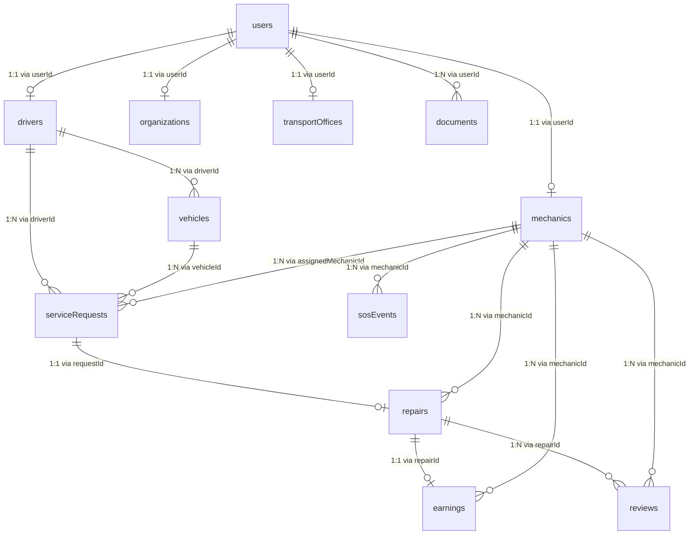

# Haul360 — Team Database Schema Documentation

> **Single Source of Truth for MongoDB Collections, Indexes, Relationships, and Lifecycle Flows**  
> *Generated directly from the active TypeScript models and backend implementation in `backend/src/models/` and `backend/src/config/`.*

---

## Table of Contents

1. [Overview & Database Architecture](#1-overview--database-architecture)
2. [Collections & Schemas](#2-collections--schemas)
   - [users](#1-users)
   - [drivers](#2-drivers)
   - [mechanics](#3-mechanics)
   - [organizations](#4-organizations)
   - [transportOffices](#5-transportoffices)
   - [vehicles](#6-vehicles)
   - [documents](#7-documents)
   - [serviceRequests](#8-servicerequests)
   - [repairs](#9-repairs)
   - [earnings](#10-earnings)
   - [reviews](#11-reviews)
   - [sosEvents](#12-sosevents)
3. [Collection Relationships](#3-collection-relationships)
4. [MongoDB Indexes](#4-mongodb-indexes)
5. [Mechanic Availability Lifecycle](#5-mechanic-availability-lifecycle)
6. [API → Database Mapping](#6-api--database-mapping)
7. [Schema Change & Migration Policy](#7-schema-change--migration-policy)

---

## 1. Overview & Database Architecture

Haul360 utilizes **MongoDB Atlas** as its document database via the official MongoDB Node.js driver (`mongodb` v6.x).

- **Database Name**: `haul360` (Configurable via `MONGODB_DB_NAME`)
- **Connection Management**: Centralized singleton `MongoClient` in `backend/src/config/database.ts` with connection pooling (`minPoolSize: 2`, `maxPoolSize: 10`).
- **Initialization**: On server startup (`backend/src/server.ts`), the application automatically executes safe schema migrations and index creation.
- **Data Types**: All dates are stored as native BSON `Date` objects (`ISODate`), primary keys as `ObjectId` (`_id`), and cross-collection references via `ObjectId` or string IDs.

---

## 2. Collections & Schemas

Haul360 manages 12 distinct MongoDB collections.

---

### 1. `users`

**Purpose**: Core user identity, authentication, and global account status. Every platform user (Driver, Mechanic, Fleet Organization, Transport Office) has exactly one record here.

**Used By**: All Roles (`driver`, `mechanic`, `organization`, `transport_office`)  
**API Endpoints**: `POST /api/auth/register`, `POST /api/auth/login`, `POST /api/auth/refresh`, `GET /api/auth/me`, `PUT /api/mechanic/profile`

| Field | Type | Required | Default | Allowed Values / Enum | Description |
|---|---|---|---|---|---|
| `_id` | `ObjectId` | Yes | Auto-generated | Valid ObjectId | MongoDB Primary Key |
| `role` | `string` | Yes | — | `'driver'`, `'mechanic'`, `'organization'`, `'transport_office'` | User account role |
| `firstName` | `string` | No | — | Free-text string | User's first name |
| `lastName` | `string` | No | — | Free-text string | User's last name |
| `mobile` | `string` | Yes | — | Digits (min 10) | Unique login phone number |
| `email` | `string` | Yes | — | Valid email | Login / notification email |
| `passwordHash` | `string` | Yes | — | Bcrypt hash string | Salted bcrypt hash |
| `isActive` | `boolean` | Yes | `true` | `true`, `false` | Account active flag |
| `isVerified` | `boolean` | Yes | `false` | `true`, `false` | KYC/phone verification flag |
| `profileImage` | `string` | No | — | URL / URI string | Profile image avatar URL |
| `lastLoginAt` | `Date` | No | — | ISO Date | Timestamp of most recent login |
| `createdAt` | `Date` | Yes | Current Date | ISO Date | Account creation timestamp |
| `updatedAt` | `Date` | Yes | Current Date | ISO Date | Last update timestamp |

#### Example Document (`users`)

```json
{
  "_id": "674ef120a1c84b1234567890",
  "role": "mechanic",
  "firstName": "Rajesh",
  "lastName": "Sharma",
  "mobile": "9876543210",
  "email": "rajesh.sharma@example.com",
  "passwordHash": "$2a$10$e8V...encrypted...hash",
  "isActive": true,
  "isVerified": false,
  "profileImage": "https://storage.haul360.com/avatars/rajesh.jpg",
  "lastLoginAt": "2026-10-03T08:30:00.000Z",
  "createdAt": "2026-10-01T10:00:00.000Z",
  "updatedAt": "2026-10-03T08:30:00.000Z"
}
```

---

### 2. `drivers`

**Purpose**: Profile details, licensing information, and trip availability for commercial vehicle drivers.

**Used By**: Role `driver`  
**API Endpoints**: `POST /api/auth/register` (role: driver)

| Field | Type | Required | Default | Allowed Values / Enum | Description |
|---|---|---|---|---|---|
| `_id` | `ObjectId` | Yes | Auto-generated | Valid ObjectId | MongoDB Primary Key |
| `userId` | `ObjectId` | Yes | — | Reference to `users._id` | Associated user identity |
| `fullName` | `string` | Yes | — | Free-text string | Driver's full legal name |
| `age` | `number` | Yes | `0` | Non-negative integer | Driver's age in years |
| `mobile` | `string` | Yes | — | Digits | Driver contact phone number |
| `email` | `string` | Yes | — | Valid email | Driver contact email |
| `address` | `object` | Yes | — | `{ city, state, pincode }` | Driver residential address |
| `address.city` | `string` | Yes | `""` | String | Operating city |
| `address.state` | `string` | Yes | `""` | String | Operating state |
| `address.pincode` | `string` | Yes | `""` | String | Postal/PIN code |
| `profilePhoto` | `string` | No | — | URL string | Driver photo URL |
| `verificationStatus` | `string` | Yes | `'pending'` | `'pending'`, `'verified'`, `'rejected'` | Driver KYC verification |
| `availabilityStatus` | `string` | Yes | `'available'` | `'available'`, `'unavailable'`, `'on_trip'`, `'inactive'` | Driver duty/trip status |
| `rating` | `number` | Yes | `0` | `0` to `5.0` | Driver cumulative rating |
| `totalTrips` | `number` | Yes | `0` | Non-negative integer | Completed trip count |
| `createdAt` | `Date` | Yes | Current Date | ISO Date | Profile creation timestamp |
| `updatedAt` | `Date` | Yes | Current Date | ISO Date | Last update timestamp |

#### Example Document (`drivers`)

```json
{
  "_id": "674ef120a1c84b1234567891",
  "userId": "674ef120a1c84b1234567890",
  "fullName": "Amit Kumar",
  "age": 34,
  "mobile": "9812345678",
  "email": "amit.kumar@example.com",
  "address": {
    "city": "Gurugram",
    "state": "Haryana",
    "pincode": "122001"
  },
  "verificationStatus": "verified",
  "availabilityStatus": "available",
  "rating": 4.85,
  "totalTrips": 142,
  "createdAt": "2026-09-15T08:00:00.000Z",
  "updatedAt": "2026-10-02T14:20:00.000Z"
}
```

---

### 3. `mechanics`

**Purpose**: Workshop profile, commercial repair specializations, dispatch availability, 24/7 SOS dispatch preference, and performance ratings for heavy commercial mechanics.

**Used By**: Role `mechanic`  
**API Endpoints**: `GET /api/mechanic/profile`, `PUT /api/mechanic/profile`, `PATCH /api/mechanic/availability`, `PATCH /api/mechanic/sos`, `GET /api/mechanic/summary`, `POST /api/mechanic/requests/:id/accept`

> [!IMPORTANT]
> **Canonical Field**: `availability` (`'AVAILABLE'`, `'BUSY'`, `'OFFLINE'`).  
> The legacy field `availabilityStatus` has been removed and consolidated into `availability` by database migration.

| Field | Type | Required | Default | Allowed Values / Enum | Description |
|---|---|---|---|---|---|
| `_id` | `ObjectId` | Yes | Auto-generated | Valid ObjectId | MongoDB Primary Key |
| `userId` | `ObjectId` | Yes | — | Reference to `users._id` | Associated user identity |
| `fullName` | `string` | No | — | Free-text string | Mechanic's full name |
| `mobile` | `string` | No | — | Digits | Contact phone number |
| `email` | `string` | No | — | Valid email | Contact email |
| `profilePhoto` | `string` | No | — | URL string | Photo URL |
| `experienceYears` | `number` | No | `10` | Non-negative integer | Years of commercial experience |
| `experienceCertificate` | `string` | No | — | URL string | Certificate document link |
| `workshopDetails` | `object` | No | — | Nested object | Physical workshop facility info |
| `workshopDetails.workshopName` | `string` | Yes | — | Free-text string | Workshop garage trade name |
| `workshopDetails.workshopAddress` | `string` | No | — | Free-text string | Street address / highway corridor |
| `workshopDetails.address` | `string` | No | — | Free-text string | Alternate address |
| `workshopDetails.city` | `string` | Yes | — | Free-text string | Base city |
| `workshopDetails.state` | `string` | Yes | — | Free-text string | Base state |
| `workshopDetails.pincode` | `string` | Yes | — | Postal code string | Postal/PIN code |
| `serviceDetails` | `object` | No | — | Nested object | Service capabilities & coverage |
| `serviceDetails.vehicleTypes` | `string[]` | Yes | `[...]` | e.g. `'16-22 Wheeler Multi-Axle'`, `'Heavy Dumpers & Tippers'`, `'LCVs & Cargo Vans'` | Supported commercial vehicle types |
| `serviceDetails.services` | `string[]` | No | `[...]` | e.g. `'Air Brakes & Pneumatic Overhaul'`, `'Engine & Powertrain Diagnostics'` | Specific repair services |
| `serviceDetails.serviceCategories` | `string[]` | No | `[...]` | e.g. `'Engine'`, `'Air Brakes'`, `'Electrical'` | Service categories |
| `serviceDetails.specializations` | `string[]` | No | `[...]` | Specialization tags | Specialization areas |
| `serviceDetails.coverageRadius` | `string` | No | `'35 km Patrol Ring'` | Free-text string | Highway patrol ring description |
| `serviceDetails.serviceRadiusKm` | `number` | No | `35` | Positive number | Service operational radius in km |
| `serviceDetails.availableFrom` | `string` | No | `'08:00'` | Time string (HH:MM) | Operating hours start |
| `serviceDetails.availableTo` | `string` | No | `'22:00'` | Time string (HH:MM) | Operating hours end |
| `serviceDetails.mechanicType` | `string` | No | `'General Heavy Commercial'` | Free-text string | Mechanic classification |
| `availability` | `string` | Yes | `'AVAILABLE'` | `'AVAILABLE'`, `'BUSY'`, `'OFFLINE'` | **Canonical dispatch availability** |
| `sosMode` | `boolean` | Yes | `true` | `true`, `false` | Opted in to 24/7 highway SOS |
| `verificationStatus` | `string` | No | `'pending'` | `'pending'`, `'verified'`, `'rejected'`, `'PENDING'`, `'VERIFIED'`, `'REJECTED'` | Verification state |
| `verification.status` | `string` | No | `'PENDING'` | `'PENDING'`, `'VERIFIED'`, `'REJECTED'` | Nested verification status |
| `rating` | `number` or `object` | No | `4.9` | Number or `{ average, count }` | Mechanic score |
| `totalReviews` | `number` | No | `48` | Non-negative integer | Total review count |
| `totalCompletedRepairs` | `number` | No | `120` | Non-negative integer | Completed repair counter |
| `stats` | `object` | No | — | `{ totalRepairsCompleted, totalRequestsReceived }` | Mechanic activity metrics |
| `createdAt` | `Date` | Yes | Current Date | ISO Date | Profile creation timestamp |
| `updatedAt` | `Date` | Yes | Current Date | ISO Date | Last update timestamp |

#### Example Document (`mechanics`)

```json
{
  "_id": "674ef120a1c84b1234567892",
  "userId": "674ef120a1c84b1234567890",
  "fullName": "Rajesh Sharma",
  "mobile": "9876543210",
  "email": "rajesh.sharma@example.com",
  "experienceYears": 12,
  "workshopDetails": {
    "workshopName": "Rajesh Commercial Fleet Repair Hub",
    "workshopAddress": "NH-48 Express Corridor, Sector 34",
    "city": "Gurugram",
    "state": "Haryana",
    "pincode": "122001"
  },
  "serviceDetails": {
    "workshopName": "Rajesh Commercial Fleet Repair Hub",
    "workshopAddress": "NH-48 Express Corridor, Sector 34",
    "city": "Gurugram",
    "state": "Haryana",
    "pincode": "122001",
    "vehicleTypes": [
      "16-22 Wheeler Multi-Axle",
      "Heavy Dumpers & Tippers",
      "LCVs & Cargo Vans"
    ],
    "services": [
      "Engine & Powertrain Diagnostics",
      "Air Brakes & Pneumatic Overhaul",
      "Heavy Electricals & Alternators",
      "Hydraulic Steering & Suspension"
    ],
    "serviceCategories": [
      "Engine & Powertrain Diagnostics",
      "Air Brakes & Pneumatic Overhaul"
    ],
    "coverageRadius": "35 km Patrol Ring",
    "serviceRadiusKm": 35,
    "availableFrom": "08:00",
    "availableTo": "22:00",
    "mechanicType": "General Heavy Commercial"
  },
  "availability": "AVAILABLE",
  "sosMode": true,
  "verificationStatus": "verified",
  "verification": {
    "status": "VERIFIED"
  },
  "rating": {
    "average": 4.9,
    "count": 48
  },
  "stats": {
    "totalRepairsCompleted": 120,
    "totalRequestsReceived": 145
  },
  "createdAt": "2026-09-10T06:00:00.000Z",
  "updatedAt": "2026-10-03T09:00:00.000Z"
}
```

---

### 4. `organizations`

**Purpose**: Logistics and fleet operating companies managing vehicles, freight shipments, and contracted drivers.

**Used By**: Role `organization`  
**API Endpoints**: `POST /api/auth/register` (role: organization)

| Field | Type | Required | Default | Allowed Values / Enum | Description |
|---|---|---|---|---|---|
| `_id` | `ObjectId` | Yes | Auto-generated | Valid ObjectId | MongoDB Primary Key |
| `userId` | `ObjectId` | Yes | — | Reference to `users._id` | Associated user identity |
| `organizationName` | `string` | Yes | — | Free-text string | Registered company legal name |
| `ownerName` | `string` | Yes | — | Free-text string | Authorized director / owner |
| `mobile` | `string` | Yes | — | Digits | Business contact phone |
| `email` | `string` | Yes | — | Valid email | Business contact email |
| `gstNumber` | `string` | Yes | `""` | 15-char GSTIN string | GST Identification Number |
| `businessAddress` | `object` | Yes | — | `{ addressLine, city, state, pincode }` | Registered office address |
| `businessAddress.addressLine` | `string` | Yes | `""` | String | Street address |
| `businessAddress.city` | `string` | Yes | `""` | String | Registered city |
| `businessAddress.state` | `string` | Yes | `""` | String | Registered state |
| `businessAddress.pincode` | `string` | Yes | `""` | String | Postal/PIN code |
| `organizationType` | `string` | Yes | `'Logistics'` | Free-text string | Business classification |
| `verificationStatus` | `string` | Yes | `'pending'` | `'pending'`, `'verified'`, `'rejected'` | Corporate KYC status |
| `rating` | `number` | Yes | `0` | `0` to `5.0` | Organization rating |
| `totalShipments` | `number` | Yes | `0` | Non-negative integer | Completed shipment count |
| `createdAt` | `Date` | Yes | Current Date | ISO Date | Registration timestamp |
| `updatedAt` | `Date` | Yes | Current Date | ISO Date | Last update timestamp |

#### Example Document (`organizations`)

```json
{
  "_id": "674ef120a1c84b1234567893",
  "userId": "674ef120a1c84b1234567890",
  "organizationName": "North-South Cargo Express Pvt Ltd",
  "ownerName": "Virender Sehgal",
  "mobile": "9811122233",
  "email": "ops@nscargo.com",
  "gstNumber": "07AAAAA0000A1Z5",
  "businessAddress": {
    "addressLine": "Plot 45, Udyog Vihar Phase 4",
    "city": "Gurugram",
    "state": "Haryana",
    "pincode": "122016"
  },
  "organizationType": "Logistics & Heavy Transport",
  "verificationStatus": "verified",
  "rating": 4.7,
  "totalShipments": 850,
  "createdAt": "2026-08-01T10:00:00.000Z",
  "updatedAt": "2026-10-01T12:00:00.000Z"
}
```

---

### 5. `transportOffices`

**Purpose**: Physical hub stations, dispatch terminals, and regional booking transport offices.

**Used By**: Role `transport_office`  
**API Endpoints**: `POST /api/auth/register` (role: transport_office)

| Field | Type | Required | Default | Allowed Values / Enum | Description |
|---|---|---|---|---|---|
| `_id` | `ObjectId` | Yes | Auto-generated | Valid ObjectId | MongoDB Primary Key |
| `userId` | `ObjectId` | Yes | — | Reference to `users._id` | Associated user identity |
| `officeName` | `string` | Yes | — | Free-text string | Transport branch/office name |
| `contactPerson` | `string` | Yes | — | Free-text string | Branch manager name |
| `mobile` | `string` | Yes | — | Digits | Office phone number |
| `email` | `string` | Yes | — | Valid email | Office email address |
| `address` | `object` | Yes | — | `{ addressLine, city, state, pincode }` | Terminal physical address |
| `address.addressLine` | `string` | Yes | `""` | String | Terminal location details |
| `address.city` | `string` | Yes | `""` | String | Station city |
| `address.state` | `string` | Yes | `""` | String | Station state |
| `address.pincode` | `string` | Yes | `""` | String | Postal/PIN code |
| `verificationStatus` | `string` | Yes | `'pending'` | `'pending'`, `'verified'`, `'rejected'` | Verification status |
| `rating` | `number` | Yes | `0` | `0` to `5.0` | Office performance rating |
| `createdAt` | `Date` | Yes | Current Date | ISO Date | Creation timestamp |
| `updatedAt` | `Date` | Yes | Current Date | ISO Date | Last update timestamp |

#### Example Document (`transportOffices`)

```json
{
  "_id": "674ef120a1c84b1234567894",
  "userId": "674ef120a1c84b1234567890",
  "officeName": "Sanjay Gandhi Transport Nagar Hub 4",
  "contactPerson": "Sunil Bansal",
  "mobile": "9899988877",
  "email": "sgtn.hub4@haul360.com",
  "address": {
    "addressLine": "Gate 2, GT Karnal Road",
    "city": "Delhi",
    "state": "Delhi",
    "pincode": "110042"
  },
  "verificationStatus": "verified",
  "rating": 4.9,
  "createdAt": "2026-08-15T09:00:00.000Z",
  "updatedAt": "2026-09-30T16:00:00.000Z"
}
```

---

### 6. `vehicles`

**Purpose**: Commercial truck, trailer, container, and tipper registry linked to assigned drivers and fleets.

**Used By**: Roles `driver`, `organization`

| Field | Type | Required | Default | Allowed Values / Enum | Description |
|---|---|---|---|---|---|
| `_id` | `ObjectId` | Yes | Auto-generated | Valid ObjectId | MongoDB Primary Key |
| `driverId` | `ObjectId` | Yes | — | Reference to `drivers._id` | Primary assigned driver |
| `vehicleNumber` | `string` | Yes | — | Uppercase registration string | Unique vehicle plate number |
| `vehicleType` | `string` | Yes | — | e.g. `'16-Wheeler'`, `'Trailer'`, `'Tipper'` | Commercial body style |
| `capacityKg` | `number` | Yes | — | Positive number | Payload capacity stored in KG |
| `make` | `string` | No | — | e.g. `'Tata Motors'`, `'Ashok Leyland'` | Vehicle manufacturer |
| `model` | `string` | No | — | e.g. `'Signa 4825.T'`, `'Prima 3530.K'` | Vehicle model name |
| `year` | `number` | No | — | 4-digit year | Manufacturing year |
| `insuranceDocument` | `string` | No | — | URL string | Insurance policy document |
| `rcDocument` | `string` | No | — | URL string | RC Book copy URL |
| `fastagId` | `string` | No | — | FASTag Tag ID string | National electronic toll ID |
| `status` | `string` | Yes | — | `'active'`, `'inactive'`, `'maintenance'`, `'on_trip'` | Current fleet availability |
| `createdAt` | `Date` | Yes | Current Date | ISO Date | Registration timestamp |
| `updatedAt` | `Date` | Yes | Current Date | ISO Date | Last update timestamp |

#### Example Document (`vehicles`)

```json
{
  "_id": "674ef120a1c84b1234567895",
  "driverId": "674ef120a1c84b1234567891",
  "vehicleNumber": "HR-55-AJ-9921",
  "vehicleType": "16-22 Wheeler Multi-Axle",
  "capacityKg": 25000,
  "make": "Tata Motors",
  "model": "Signa 4825.T BS6",
  "year": 2023,
  "insuranceDocument": "https://storage.haul360.com/docs/ins_hr55aj9921.pdf",
  "rcDocument": "https://storage.haul360.com/docs/rc_hr55aj9921.pdf",
  "fastagId": "34161FA82032049",
  "status": "active",
  "createdAt": "2026-09-01T10:00:00.000Z",
  "updatedAt": "2026-10-02T11:00:00.000Z"
}
```

---

### 7. `documents`

**Purpose**: KYC identification, driver licenses, workshop trade licenses, vehicle certificates, and compliance records.

**Used By**: All Roles (`users`, `mechanic`, `driver`)  
**API Endpoints**: `GET /api/mechanic/documents`, `GET /api/mechanic/documents/:id`

| Field | Type | Required | Default | Allowed Values / Enum | Description |
|---|---|---|---|---|---|
| `_id` | `ObjectId` | Yes | Auto-generated | Valid ObjectId | MongoDB Primary Key |
| `userId` | `ObjectId` | Yes | — | Reference to `users._id` | Owner user ID |
| `documentType` | `string` | Yes | — | `'aadhaar'`, `'pan'`, `'voter_id'`, `'driving_license'`, `'rc_book'`, `'vehicle_insurance'`, `'experience_certificate'`, `'other'` | Classification type |
| `documentUrl` | `string` | Yes | — | Secure URL string | Cloud storage link |
| `verificationStatus` | `string` | Yes | `'pending'` | `'pending'`, `'verified'`, `'rejected'` | Document verification status |
| `verifiedAt` | `Date` | No | — | ISO Date | Approval timestamp |
| `rejectionReason` | `string` | No | — | Free-text string | Rejection explanation |
| `createdAt` | `Date` | Yes | Current Date | ISO Date | Upload timestamp |
| `updatedAt` | `Date` | Yes | Current Date | ISO Date | Last update timestamp |

#### Example Document (`documents`)

```json
{
  "_id": "674ef120a1c84b1234567896",
  "userId": "674ef120a1c84b1234567890",
  "documentType": "experience_certificate",
  "documentUrl": "https://storage.haul360.com/docs/exp_cert_rajesh.pdf",
  "verificationStatus": "verified",
  "verifiedAt": "2026-09-12T14:30:00.000Z",
  "createdAt": "2026-09-11T09:00:00.000Z",
  "updatedAt": "2026-09-12T14:30:00.000Z"
}
```

---

### 8. `serviceRequests`

**Purpose**: Breakdown emergency alerts, scheduled maintenance tickets, and service dispatch orders created by drivers/fleets for roadside mechanics.

**Used By**: Roles `mechanic`, `driver`, `organization`  
**API Endpoints**: `GET /api/mechanic/requests`, `GET /api/mechanic/requests/:id`, `POST /api/mechanic/requests/:id/accept`, `POST /api/mechanic/requests/:id/reject`

| Field | Type | Required | Default | Allowed Values / Enum | Description |
|---|---|---|---|---|---|
| `_id` | `ObjectId` | Yes | Auto-generated | Valid ObjectId | MongoDB Primary Key |
| `requestId` | `string` | Yes | — | Unique string (e.g. `'REQ-4401'`) | Human-readable ticket code |
| `vehicleId` | `ObjectId` or `string` | No | — | Reference to `vehicles._id` | Breakdown vehicle reference |
| `driverId` | `ObjectId` or `string` | No | — | Reference to `drivers._id` | Requesting driver reference |
| `organizationId` | `ObjectId` or `string` | No | — | Reference to `organizations._id` | Fleet owner reference |
| `assignedMechanicId` | `ObjectId` | No | — | Reference to `mechanics._id` | Mechanic who accepted |
| `rejectedMechanicIds` | `ObjectId[]` | No | `[]` | Array of `mechanics._id` | Mechanics who passed/rejected |
| `driverName` | `string` | No | — | Free-text string | Driver contact name |
| `driverPhone` | `string` | No | — | Free-text string | Driver phone number |
| `vehicleNumber` | `string` | No | — | Vehicle plate string | Commercial vehicle plate |
| `vehicleType` | `string` | No | — | Vehicle category string | e.g. `'16-22 Wheeler Multi-Axle'` |
| `serviceCategory` | `string` | No | — | Service category string | e.g. `'Air Brake System'` |
| `requestedServices` | `string[]` | Yes | `[]` | Array of strings | Requested repair items |
| `issueDescription` | `string` | Yes | — | Free-text description | Driver description of problem |
| `location` | `object` | Yes | — | Nested object | Incident GPS & highway location |
| `location.address` | `string` | Yes | — | Highway corridor string | Street / milestone address |
| `location.landmark` | `string` | No | — | Landmark string | Toll plaza / pump landmark |
| `location.latitude` | `number` | No | — | Coordinate number | GPS Latitude |
| `location.longitude` | `number` | No | — | Coordinate number | GPS Longitude |
| `location.distanceKm` | `number` | No | — | Distance number | Distance from mechanic in km |
| `urgency` | `string` | Yes | `'NORMAL'` | `'SOS'`, `'URGENT'`, `'NORMAL'`, `'SCHEDULED'` | Severity classification |
| `isEmergency` | `boolean` | No | `false` | `true`, `false` | Critical highway emergency |
| `isScheduled` | `boolean` | No | `false` | `true`, `false` | Scheduled appointment |
| `scheduledAt` | `Date` | No | — | ISO Date | Scheduled service timestamp |
| `estimatedCost` | `number` | No | — | Positive number | Initial quote / estimated cost |
| `status` | `string` | Yes | `'PENDING'` | `'PENDING'`, `'OFFERED'`, `'ACCEPTED'`, `'REJECTED'`, `'IN_PROGRESS'`, `'COMPLETED'`, `'CANCELLED'` | Lifecycle dispatch status |
| `acceptedAt` | `Date` | No | — | ISO Date | Timestamp when accepted |
| `rejectedAt` | `Date` | No | — | ISO Date | Timestamp when rejected |
| `completedAt` | `Date` | No | — | ISO Date | Timestamp when completed |
| `createdAt` | `Date` | Yes | Current Date | ISO Date | Creation timestamp |
| `updatedAt` | `Date` | Yes | Current Date | ISO Date | Last update timestamp |

#### Example Document (`serviceRequests`)

```json
{
  "_id": "674ef120a1c84b1234567897",
  "requestId": "REQ-8902",
  "driverId": "674ef120a1c84b1234567891",
  "assignedMechanicId": "674ef120a1c84b1234567892",
  "rejectedMechanicIds": [],
  "driverName": "Amit Kumar",
  "driverPhone": "+91 98123 45678",
  "vehicleNumber": "HR-55-AJ-9921",
  "vehicleType": "16-22 Wheeler Multi-Axle",
  "serviceCategory": "Air Brake System",
  "requestedServices": [
    "Air Brakes & Pneumatic Overhaul",
    "Pressure Valve Replacement"
  ],
  "issueDescription": "Sudden pneumatic pressure drop near toll corridor; trailer brakes locked.",
  "location": {
    "address": "NH-48 Km Milestone 62, Near Kherki Daula",
    "landmark": "Near Toll Plaza 4",
    "latitude": 28.3854,
    "longitude": 76.9732,
    "distanceKm": 8.4
  },
  "urgency": "SOS",
  "isEmergency": true,
  "isScheduled": false,
  "estimatedCost": 4500,
  "status": "ACCEPTED",
  "acceptedAt": "2026-10-03T09:10:00.000Z",
  "createdAt": "2026-10-03T09:05:00.000Z",
  "updatedAt": "2026-10-03T09:10:00.000Z"
}
```

---

### 9. `repairs`

**Purpose**: Active and historical repair work orders executed by mechanics on breakdown sites or workshops.

**Used By**: Role `mechanic`  
**API Endpoints**: `GET /api/mechanic/repairs`, `GET /api/mechanic/repairs/:id`, `POST /api/mechanic/repairs/:id/arrive`, `POST /api/mechanic/repairs/:id/diagnose`, `POST /api/mechanic/repairs/:id/start`, `POST /api/mechanic/repairs/:id/ready`, `POST /api/mechanic/repairs/:id/complete`, `GET /api/mechanic/service-history`

| Field | Type | Required | Default | Allowed Values / Enum | Description |
|---|---|---|---|---|---|
| `_id` | `ObjectId` | Yes | Auto-generated | Valid ObjectId | MongoDB Primary Key |
| `repairId` | `string` | Yes | — | Unique code (e.g. `'REP-1082'`) | Job card identifier |
| `requestId` | `ObjectId` or `string` | Yes | — | Reference to `serviceRequests._id` | Originating request |
| `mechanicId` | `ObjectId` | Yes | — | Reference to `mechanics._id` | Assigned mechanic |
| `driverId` | `ObjectId` or `string` | No | — | Reference to `drivers._id` | Vehicle driver |
| `driverName` | `string` | No | — | Free-text string | Driver contact name |
| `driverPhone` | `string` | No | — | Free-text string | Driver contact phone |
| `vehicleId` | `ObjectId` or `string` | No | — | Reference to `vehicles._id` | Vehicle reference |
| `vehicleNumber` | `string` | No | — | Vehicle plate string | Commercial vehicle plate |
| `vehicleType` | `string` | No | — | Vehicle type string | e.g. `'16-22 Wheeler Multi-Axle'` |
| `serviceCategory` | `string` | No | — | Service category string | e.g. `'Air Brake System'` |
| `issueDescription` | `string` | Yes | — | Free-text string | Reported problem |
| `diagnosis` | `string` | No | — | Free-text string | Mechanic inspection note |
| `serviceItems` | `object[]` | No | `[]` | `[{ title, cost, completed }]` | Breakdown of labor items |
| `parts` | `object[]` | No | `[]` | `[{ name, partNumber, cost, quantity }]` | Replaced spare parts |
| `laborAmount` | `number` | Yes | `0` | Non-negative number | Labor charge total |
| `partsAmount` | `number` | Yes | `0` | Non-negative number | Parts charge total |
| `totalAmount` | `number` | Yes | `0` | Non-negative number | Sum of labor + parts |
| `status` | `string` | Yes | `'RECEIVED'` | `'RECEIVED'`, `'DIAGNOSING'`, `'REPAIRING'`, `'READY_FOR_TESTING'`, `'COMPLETED'`, `'CANCELLED'` | Repair stage |
| `currentStepIndex` | `number` | Yes | `0` | `0` to `4` | Progress indicator index |
| `location` | `object` | No | — | `{ address, landmark, latitude, longitude }` | Breakdown location |
| `arrivedAt` | `Date` | No | — | ISO Date | Timestamp mechanic arrived |
| `diagnosedAt` | `Date` | No | — | ISO Date | Timestamp diagnosis finished |
| `startedAt` | `Date` | No | — | ISO Date | Timestamp repair started |
| `readyAt` | `Date` | No | — | ISO Date | Timestamp marked ready for test |
| `completedAt` | `Date` | No | — | ISO Date | Timestamp job finished & signed off |
| `createdAt` | `Date` | Yes | Current Date | ISO Date | Ticket creation timestamp |
| `updatedAt` | `Date` | Yes | Current Date | ISO Date | Last update timestamp |

#### Example Document (`repairs`)

```json
{
  "_id": "674ef120a1c84b1234567898",
  "repairId": "REP-4402",
  "requestId": "674ef120a1c84b1234567897",
  "mechanicId": "674ef120a1c84b1234567892",
  "driverName": "Amit Kumar",
  "driverPhone": "+91 98123 45678",
  "vehicleNumber": "HR-55-AJ-9921",
  "vehicleType": "16-22 Wheeler Multi-Axle",
  "serviceCategory": "Air Brake Overhaul",
  "issueDescription": "Pneumatic pressure drop; air leak at dual check valve",
  "diagnosis": "Dual check valve internal seal blown under heavy load braking.",
  "serviceItems": [
    { "title": "Pneumatic System Diagnosis", "cost": 1500, "completed": true },
    { "title": "Dual Valve Overhaul & Air Bleed", "cost": 1500, "completed": true }
  ],
  "parts": [
    { "name": "Heavy Dual Check Valve", "partNumber": "DC-881", "cost": 1500, "quantity": 1 }
  ],
  "laborAmount": 3000,
  "partsAmount": 1500,
  "totalAmount": 4500,
  "status": "COMPLETED",
  "currentStepIndex": 4,
  "location": {
    "address": "NH-48 Km Milestone 62, Near Kherki Daula",
    "landmark": "Near Toll Plaza 4",
    "latitude": 28.3854,
    "longitude": 76.9732
  },
  "arrivedAt": "2026-10-03T09:20:00.000Z",
  "diagnosedAt": "2026-10-03T09:30:00.000Z",
  "startedAt": "2026-10-03T09:40:00.000Z",
  "readyAt": "2026-10-03T10:15:00.000Z",
  "completedAt": "2026-10-03T10:30:00.000Z",
  "createdAt": "2026-10-03T09:10:00.000Z",
  "updatedAt": "2026-10-03T10:30:00.000Z"
}
```

---

### 10. `earnings`

**Purpose**: Financial settlements, service payments, performance bonuses, and ledger entries for mechanics.

**Used By**: Role `mechanic`  
**API Endpoints**: `GET /api/mechanic/earnings`, `GET /api/mechanic/earnings/summary`

| Field | Type | Required | Default | Allowed Values / Enum | Description |
|---|---|---|---|---|---|
| `_id` | `ObjectId` | Yes | Auto-generated | Valid ObjectId | MongoDB Primary Key |
| `transactionId` | `string` | Yes | — | Unique code (e.g. `'TXN-54321'`) | Settlement transaction ID |
| `mechanicId` | `ObjectId` | Yes | — | Reference to `mechanics._id` | Beneficiary mechanic |
| `repairId` | `ObjectId` or `string` | No | — | Reference to `repairs._id` | Associated repair ticket |
| `repairReference` | `string` | No | — | Repair code (e.g. `'REP-4402'`) | Human-readable repair ref |
| `vehicleNumber` | `string` | No | — | Vehicle plate string | Commercial vehicle plate |
| `serviceTitle` | `string` | No | — | Free-text string | Service description |
| `amount` | `number` | Yes | — | Positive number | Payout amount in INR |
| `status` | `string` | Yes | `'PENDING'` | `'PENDING'`, `'PROCESSING'`, `'SETTLED'` | Settlement status |
| `type` | `string` | Yes | `'SERVICE_PAYMENT'` | `'SERVICE_PAYMENT'`, `'BONUS'`, `'ADJUSTMENT'` | Transaction type |
| `description` | `string` | No | — | Free-text string | Transaction details |
| `paymentMode` | `string` | No | `'Instant SLA Direct Deposit'` | Free-text string | Payout method |
| `settledAt` | `Date` | No | — | ISO Date | Settlement release date |
| `createdAt` | `Date` | Yes | Current Date | ISO Date | Transaction creation date |
| `updatedAt` | `Date` | Yes | Current Date | ISO Date | Last update timestamp |

#### Example Document (`earnings`)

```json
{
  "_id": "674ef120a1c84b1234567899",
  "transactionId": "TXN-88412",
  "mechanicId": "674ef120a1c84b1234567892",
  "repairId": "674ef120a1c84b1234567898",
  "repairReference": "REP-4402",
  "vehicleNumber": "HR-55-AJ-9921",
  "serviceTitle": "Air Brake Overhaul",
  "amount": 4500,
  "status": "SETTLED",
  "type": "SERVICE_PAYMENT",
  "description": "Settlement for job REP-4402 (HR-55-AJ-9921)",
  "paymentMode": "Instant SLA Direct Deposit",
  "settledAt": "2026-10-03T10:30:00.000Z",
  "createdAt": "2026-10-03T10:30:00.000Z",
  "updatedAt": "2026-10-03T10:30:00.000Z"
}
```

---

### 11. `reviews`

**Purpose**: Customer feedback, star ratings, and tags left by drivers and fleet operators for completed mechanic service jobs.

**Used By**: Role `mechanic`  
**API Endpoints**: `GET /api/mechanic/reviews`, `GET /api/mechanic/reviews/summary`

| Field | Type | Required | Default | Allowed Values / Enum | Description |
|---|---|---|---|---|---|
| `_id` | `ObjectId` | Yes | Auto-generated | Valid ObjectId | MongoDB Primary Key |
| `reviewId` | `string` | Yes | — | Unique code (e.g. `'REV-9912'`) | Review ticket code |
| `repairId` | `ObjectId` or `string` | No | — | Reference to `repairs._id` | Associated repair ticket |
| `mechanicId` | `ObjectId` | Yes | — | Reference to `mechanics._id` | Reviewed mechanic |
| `reviewerId` | `ObjectId` or `string` | No | — | Reference to `users._id` / `drivers._id` | Driver or fleet user |
| `reviewerName` | `string` | Yes | — | Free-text string | Display name of reviewer |
| `driverRole` | `string` | No | `'Fleet Captain'` | Free-text string | Reviewer role title |
| `vehicleType` | `string` | No | — | Vehicle classification | e.g. `'16-22 Wheeler Multi-Axle'` |
| `serviceCategory` | `string` | No | — | Service category | e.g. `'Air Brakes'` |
| `rating` | `number` | Yes | — | `1` to `5` | Star rating score |
| `comment` | `string` | Yes | — | Free-text string | Customer review text |
| `tags` | `string[]` | No | `[]` | Array of strings | e.g. `["On-Time", "Expert Tooling"]` |
| `createdAt` | `Date` | Yes | Current Date | ISO Date | Review submission date |
| `updatedAt` | `Date` | Yes | Current Date | ISO Date | Last update timestamp |

#### Example Document (`reviews`)

```json
{
  "_id": "674ef120a1c84b123456789a",
  "reviewId": "REV-3310",
  "repairId": "674ef120a1c84b1234567898",
  "mechanicId": "674ef120a1c84b1234567892",
  "reviewerName": "Amit Kumar",
  "driverRole": "Senior Fleet Captain",
  "vehicleType": "16-22 Wheeler Multi-Axle",
  "serviceCategory": "Air Brakes",
  "rating": 5,
  "comment": "Reached NH-48 breakdown site in under 20 minutes with full compressor tools. Repaired pneumatics immediately.",
  "tags": ["Fast Arrival", "Expert Diagnostics", "Fair Pricing"],
  "createdAt": "2026-10-03T11:00:00.000Z",
  "updatedAt": "2026-10-03T11:00:00.000Z"
}
```

---

### 12. `sosEvents`

**Purpose**: Highway emergency distress alerts triggered directly by mechanics in dangerous roadside scenarios (e.g. hazard on dark highway, medical assistance, security assistance).

**Used By**: Role `mechanic`  
**API Endpoints**: `POST /api/mechanic/sos/trigger`, `POST /api/mechanic/sos/:id/resolve`

| Field | Type | Required | Default | Allowed Values / Enum | Description |
|---|---|---|---|---|---|
| `_id` | `ObjectId` | Yes | Auto-generated | Valid ObjectId | MongoDB Primary Key |
| `sosId` | `string` | Yes | — | Unique code (e.g. `'SOS-9011'`) | Emergency event identifier |
| `mechanicId` | `ObjectId` | Yes | — | Reference to `mechanics._id` | Mechanic in distress |
| `location` | `object` | Yes | — | Nested object | Distress coordinates |
| `location.address` | `string` | Yes | — | String | Highway corridor location |
| `location.landmark` | `string` | No | — | String | Nearest milestone / toll |
| `location.latitude` | `number` | No | — | Coordinate number | GPS Latitude |
| `location.longitude` | `number` | No | — | Coordinate number | GPS Longitude |
| `status` | `string` | Yes | `'ACTIVE'` | `'ACTIVE'`, `'RESOLVED'`, `'CANCELLED'` | Emergency status |
| `reason` | `string` | No | — | Free-text string | Reason for SOS trigger |
| `resolvedAt` | `Date` | No | — | ISO Date | Timestamp incident resolved |
| `createdAt` | `Date` | Yes | Current Date | ISO Date | Trigger timestamp |
| `updatedAt` | `Date` | Yes | Current Date | ISO Date | Last update timestamp |

#### Example Document (`sosEvents`)

```json
{
  "_id": "674ef120a1c84b123456789b",
  "sosId": "SOS-5501",
  "mechanicId": "674ef120a1c84b1234567892",
  "location": {
    "address": "NH-48 Corridor Km 74",
    "landmark": "Near Bilaspur Flyover",
    "latitude": 28.3211,
    "longitude": 76.9124
  },
  "status": "ACTIVE",
  "reason": "Roadside safety perimeter breach; heavy traffic near breakdown vehicle",
  "createdAt": "2026-10-03T12:00:00.000Z",
  "updatedAt": "2026-10-03T12:00:00.000Z"
}
```

---

## 3. Collection Relationships



### Relationship Summary Table

| Source Collection | Foreign Key Field | Target Collection | Cardinality | Purpose |
|---|---|---|---|---|
| `drivers` | `userId` | `users._id` | 1:1 | Links driver profile to user authentication |
| `mechanics` | `userId` | `users._id` | 1:1 | Links mechanic profile to user authentication |
| `organizations` | `userId` | `users._id` | 1:1 | Links corporate fleet to user authentication |
| `transportOffices` | `userId` | `users._id` | 1:1 | Links regional office to user authentication |
| `vehicles` | `driverId` | `drivers._id` | N:1 | Assigns commercial vehicle to a primary driver |
| `documents` | `userId` | `users._id` | N:1 | KYC / compliance documents uploaded by a user |
| `serviceRequests` | `assignedMechanicId` | `mechanics._id` | N:1 | Identifies mechanic accepted for service dispatch |
| `serviceRequests` | `rejectedMechanicIds` | `mechanics._id[]` | N:M | Prevents re-offering rejected requests to same mechanic |
| `repairs` | `mechanicId` | `mechanics._id` | N:1 | Identifies mechanic handling the repair job |
| `repairs` | `requestId` | `serviceRequests._id` | 1:1 | Links repair work order to original service request |
| `earnings` | `mechanicId` | `mechanics._id` | N:1 | Directs payout balance to specific mechanic |
| `earnings` | `repairId` | `repairs._id` | 1:1 | Tracks financial transaction for specific repair job |
| `reviews` | `mechanicId` | `mechanics._id` | N:1 | Aggregates rating & review feedback for mechanic |
| `reviews` | `repairId` | `repairs._id` | N:1 | Validates that review originates from verified job |
| `sosEvents` | `mechanicId` | `mechanics._id` | N:1 | Tracks distress events initiated by a mechanic |

---

## 4. MongoDB Indexes

All indexes are managed and initialized programmatically at startup in `backend/src/config/databaseIndexes.ts`.

| Collection | Index Key Pattern | Constraint | Index Name | Purpose |
|---|---|---|---|---|
| `users` | `{ mobile: 1 }` | **Unique** | `idx_users_mobile_unique` | Prevents duplicate mobile phone registrations |
| `users` | `{ email: 1 }` | **Unique, Sparse** | `idx_users_email_unique` | Enforces unique email when provided |
| `users` | `{ role: 1 }` | Non-Unique | `idx_users_role` | Fast filtering of users by role |
| `drivers` | `{ userId: 1 }` | **Unique** | `idx_drivers_userId_unique` | Ensures 1:1 relationship with `users` |
| `drivers` | `{ availabilityStatus: 1 }` | Non-Unique | `idx_drivers_availabilityStatus` | Driver availability search |
| `drivers` | `{ "address.city": 1 }` | Non-Unique | `idx_drivers_city` | Driver location filtering |
| `mechanics` | `{ userId: 1 }` | **Unique** | `idx_mechanics_userId_unique` | Ensures 1:1 relationship with `users` |
| `mechanics` | `{ availability: 1 }` | Non-Unique | `idx_mechanics_availability` | **Canonical dispatch search** (`AVAILABLE`/`BUSY`/`OFFLINE`) |
| `mechanics` | `{ "workshopDetails.city": 1 }` | Non-Unique | `idx_mechanics_city` | Geolocation city filtering for workshops |
| `mechanics` | `{ "serviceDetails.vehicleTypes": 1 }` | Non-Unique | `idx_mechanics_vehicleTypes` | Multikey index matching vehicle capability |
| `organizations` | `{ userId: 1 }` | **Unique** | `idx_organizations_userId_unique` | Ensures 1:1 relationship with `users` |
| `organizations` | `{ gstNumber: 1 }` | **Unique, Sparse** | `idx_organizations_gst_unique` | Enforces unique company GSTIN |
| `organizations` | `{ "businessAddress.city": 1 }` | Non-Unique | `idx_organizations_city` | Fast corporate filtering by city |
| `transportOffices` | `{ userId: 1 }` | **Unique** | `idx_transportOffices_userId_unique` | Ensures 1:1 relationship with `users` |
| `transportOffices` | `{ "address.city": 1 }` | Non-Unique | `idx_transportOffices_city` | Terminal filtering by city |
| `vehicles` | `{ driverId: 1 }` | Non-Unique | `idx_vehicles_driverId` | Vehicle lookup for a given driver |
| `vehicles` | `{ vehicleNumber: 1 }` | **Unique** | `idx_vehicles_vehicleNumber_unique` | Enforces unique vehicle license plate |
| `vehicles` | `{ status: 1 }` | Non-Unique | `idx_vehicles_status` | Fast lookup by vehicle status |
| `documents` | `{ userId: 1 }` | Non-Unique | `idx_documents_userId` | Document lookup by user |
| `documents` | `{ documentType: 1 }` | Non-Unique | `idx_documents_documentType` | Document lookup by document type |
| `documents` | `{ verificationStatus: 1 }` | Non-Unique | `idx_documents_verificationStatus` | Verification queue filtering |
| `documents` | `{ userId: 1, documentType: 1 }` | Non-Unique (Compound) | `idx_documents_userId_documentType` | Fast user document retrieval |
| `serviceRequests` | `{ requestId: 1 }` | **Unique** | `idx_serviceRequests_requestId_unique` | Unique human-readable request ID |
| `serviceRequests` | `{ status: 1 }` | Non-Unique | `idx_serviceRequests_status` | Status filtering (PENDING, ACCEPTED, etc.) |
| `serviceRequests` | `{ assignedMechanicId: 1 }` | Non-Unique | `idx_serviceRequests_assignedMechanicId` | Mechanic dispatch queue lookup |
| `serviceRequests` | `{ isEmergency: -1, urgency: 1, createdAt: -1 }` | Non-Unique (Compound) | `idx_serviceRequests_priority` | **SOS & urgent priority dispatch sorting** |
| `repairs` | `{ repairId: 1 }` | **Unique** | `idx_repairs_repairId_unique` | Unique human-readable repair ticket code |
| `repairs` | `{ mechanicId: 1 }` | Non-Unique | `idx_repairs_mechanicId` | Mechanic active job board lookup |
| `repairs` | `{ status: 1 }` | Non-Unique | `idx_repairs_status` | Repair stage filtering |
| `repairs` | `{ requestId: 1 }` | Non-Unique | `idx_repairs_requestId` | Link to service request |
| `earnings` | `{ transactionId: 1 }` | **Unique** | `idx_earnings_transactionId_unique` | Unique transaction ID |
| `earnings` | `{ mechanicId: 1 }` | Non-Unique | `idx_earnings_mechanicId` | Mechanic ledger queries |
| `earnings` | `{ repairId: 1 }` | Non-Unique | `idx_earnings_repairId` | Lookup earnings by repair job |
| `earnings` | `{ status: 1 }` | Non-Unique | `idx_earnings_status` | Settlement status filtering |
| `earnings` | `{ createdAt: -1 }` | Non-Unique | `idx_earnings_createdAt` | Chronological ledger sorting |
| `reviews` | `{ reviewId: 1 }` | **Unique** | `idx_reviews_reviewId_unique` | Unique review identifier |
| `reviews` | `{ mechanicId: 1 }` | Non-Unique | `idx_reviews_mechanicId` | Mechanic reviews board |
| `reviews` | `{ rating: 1 }` | Non-Unique | `idx_reviews_rating` | Rating score filtering |
| `sosEvents` | `{ sosId: 1 }` | **Unique** | `idx_sosEvents_sosId_unique` | Unique SOS event identifier |
| `sosEvents` | `{ mechanicId: 1 }` | Non-Unique | `idx_sosEvents_mechanicId` | Mechanic SOS log |
| `sosEvents` | `{ status: 1 }` | Non-Unique | `idx_sosEvents_status` | Active SOS tracking |

---

## 5. Mechanic Availability Lifecycle

Mechanics transition through three canonical states:

```
  ┌────────────────────────────────────────────────────────┐
  │                                                        │
  │                      ┌───────────┐                     │
  │     Manual Toggle    │           │   Manual Toggle     │
  │   ┌─────────────────►│  OFFLINE  │◄────────────────┐   │
  │   │                  │           │                 │   │
  │   │                  └─────┬─────┘                 │   │
  │   │                        │                       │   │
  │   │                        │ Manual Toggle         │   │
  │   │                        ▼                       │   │
  │   │                  ┌───────────┐                 │   │
  │   │   Complete Job   │           │                 │   │
  │   │  ┌───────────────┤ AVAILABLE │                 │   │
  │   │  │               │           │                 │   │
  │   │  │               └─────┬─────┘                 │   │
  │   │  │                     │                       │   │
  │   │  │                     │ Accept Request        │   │
  │   │  │                     ▼                       │   │
  │   │  │               ┌───────────┐                 │   │
  │   └──┼───────────────┤   BUSY    ├─────────────────┘   │
  │      │               │           │                     │
  │      │               └───────────┘                     │
  │      └─────────────────────────────────────────────────┘
```

### 1. States Explained
- **`AVAILABLE`**: Mechanic is on active duty, willing to accept nearby highway SOS and service requests.
- **`BUSY`**: Mechanic is actively engaged on an assigned repair job. Automatically set upon calling `POST /api/mechanic/requests/:id/accept`.
- **`OFFLINE`**: Mechanic is off-duty. Dispatch requests will not ping this mechanic.

### 2. Automated Lifecycle Transitions
1. Mechanic is `AVAILABLE`.
2. Mechanic accepts request (`POST /api/mechanic/requests/:id/accept`):
   - `serviceRequests.status` becomes `'ACCEPTED'`.
   - `serviceRequests.assignedMechanicId` is set to `mechanics._id`.
   - `repairs` document is created in `'RECEIVED'` status.
   - `mechanics.availability` automatically transitions from `'AVAILABLE'` to `'BUSY'` (if not manually `OFFLINE`).
3. Mechanic advances repair through stages:
   - `RECEIVED` → `DIAGNOSING` → `REPAIRING` → `READY_FOR_TESTING` → `COMPLETED`.
4. Mechanic completes job (`POST /api/mechanic/repairs/:id/complete`):
   - `repairs.status` becomes `'COMPLETED'`.
   - `serviceRequests.status` becomes `'COMPLETED'`.
   - `earnings` document is generated and `'SETTLED'`.
   - `mechanics.stats.totalRepairsCompleted` is incremented.
   - If mechanic was in `BUSY` state, `mechanics.availability` automatically restores to `AVAILABLE` (if set to `OFFLINE` manually, it remains `OFFLINE`).

### 3. Dedicated Availability API Contract

#### `PATCH /api/mechanic/availability`
- **Authentication**: `Bearer <JWT_ACCESS_TOKEN>` (Role: `mechanic`)
- **Request Body**:
  ```json
  {
    "availability": "BUSY"
  }
  ```
- **Response**:
  ```json
  {
    "success": true,
    "message": "Mechanic availability updated successfully",
    "data": {
      "availability": "BUSY"
    }
  }
  ```

---

## 6. API → Database Mapping

All mechanic API endpoints are mounted under `/api/mechanic` and protected by `authenticate` (JWT) and `requireRole('mechanic')`.

| HTTP Method | Endpoint | Auth | Role | Request Body | Primary Collections Affected | Fields Read / Modified |
|---|---|---|---|---|---|---|
| `GET` | `/api/mechanic/profile` | Bearer JWT | `mechanic` | None | `users`, `mechanics` | Reads `users` and `mechanics` profile and workshop details |
| `PUT` | `/api/mechanic/profile` | Bearer JWT | `mechanic` | `{ firstName, lastName, email, workshopName, workshopAddress, city, state, pincode, experienceYears, services, serviceCategories, vehicleTypes, coverageRadius }` | `users`, `mechanics` | Updates `users.firstName`, `users.lastName`, `users.email`, `mechanics.serviceDetails`, `mechanics.experienceYears`, `mechanics.updatedAt` |
| `PATCH` | `/api/mechanic/availability` | Bearer JWT | `mechanic` | `{ "availability": "AVAILABLE" \| "BUSY" \| "OFFLINE" }` | `mechanics` | Updates `mechanics.availability`, `mechanics.updatedAt` |
| `PATCH` | `/api/mechanic/sos` | Bearer JWT | `mechanic` | `{ "enabled": true \| false }` | `mechanics` | Updates `mechanics.sosMode`, `mechanics.updatedAt` |
| `GET` | `/api/mechanic/summary` | Bearer JWT | `mechanic` | None | `mechanics`, `serviceRequests`, `repairs`, `earnings` | Aggregates daily metrics, active repairs count, ratings, and canonical availability |
| `GET` | `/api/mechanic/requests` | Bearer JWT | `mechanic` | None | `serviceRequests` | Reads `serviceRequests` matching pending/offered queue (sorted by emergency priority) |
| `GET` | `/api/mechanic/requests/:id` | Bearer JWT | `mechanic` | None | `serviceRequests` | Reads single `serviceRequests` by `requestId` or `_id` |
| `POST` | `/api/mechanic/requests/:id/accept` | Bearer JWT | `mechanic` | None | `serviceRequests`, `repairs`, `mechanics` | Updates `serviceRequests.status='ACCEPTED'`, sets `assignedMechanicId`, updates `mechanics.availability='BUSY'`, creates new `repairs` document |
| `POST` | `/api/mechanic/requests/:id/reject` | Bearer JWT | `mechanic` | None | `serviceRequests` | Appends `mechanic._id` to `serviceRequests.rejectedMechanicIds` |
| `GET` | `/api/mechanic/repairs` | Bearer JWT | `mechanic` | Query: `?filter=in_progress \| completed` | `repairs` | Reads active or completed `repairs` for this mechanic |
| `GET` | `/api/mechanic/repairs/:id` | Bearer JWT | `mechanic` | None | `repairs` | Reads repair ticket by `repairId` or `_id` |
| `POST` | `/api/mechanic/repairs/:id/arrive` | Bearer JWT | `mechanic` | None | `repairs` | Updates `repairs.status='DIAGNOSING'`, `repairs.arrivedAt`, `repairs.currentStepIndex=1` |
| `POST` | `/api/mechanic/repairs/:id/diagnose` | Bearer JWT | `mechanic` | None | `repairs` | Updates `repairs.status='DIAGNOSING'`, `repairs.diagnosedAt`, `repairs.currentStepIndex=1` |
| `POST` | `/api/mechanic/repairs/:id/start` | Bearer JWT | `mechanic` | None | `repairs` | Updates `repairs.status='REPAIRING'`, `repairs.startedAt`, `repairs.currentStepIndex=2` |
| `POST` | `/api/mechanic/repairs/:id/ready` | Bearer JWT | `mechanic` | None | `repairs` | Updates `repairs.status='READY_FOR_TESTING'`, `repairs.readyAt`, `repairs.currentStepIndex=3` |
| `POST` | `/api/mechanic/repairs/:id/complete` | Bearer JWT | `mechanic` | None | `repairs`, `serviceRequests`, `mechanics`, `earnings` | Updates `repairs.status='COMPLETED'`, `repairs.completedAt`, `serviceRequests.status='COMPLETED'`, updates `mechanics.availability='AVAILABLE'`, creates `earnings` settlement record |
| `GET` | `/api/mechanic/service-history` | Bearer JWT | `mechanic` | Query: `?category=Engine` | `repairs` | Reads completed `repairs` history |
| `GET` | `/api/mechanic/earnings` | Bearer JWT | `mechanic` | Query: `?filter=settled \| pending` | `earnings` | Reads `earnings` transaction ledger |
| `GET` | `/api/mechanic/earnings/summary` | Bearer JWT | `mechanic` | None | `earnings` | Computes today, week, month, and pending settlement totals |
| `GET` | `/api/mechanic/reviews` | Bearer JWT | `mechanic` | Query: `?rating=5` | `reviews` | Reads customer feedback for this mechanic |
| `GET` | `/api/mechanic/reviews/summary` | Bearer JWT | `mechanic` | None | `reviews` | Computes average rating and star breakdown (5, 4, 3, 2, 1) |
| `GET` | `/api/mechanic/documents` | Bearer JWT | `mechanic` | None | `documents` | Reads uploaded compliance documents for user |
| `GET` | `/api/mechanic/documents/:id` | Bearer JWT | `mechanic` | None | `documents` | Reads single document by `_id` |
| `POST` | `/api/mechanic/sos/trigger` | Bearer JWT | `mechanic` | `{ location: { address, latitude, longitude }, reason }` | `sosEvents` | Creates new `sosEvents` record with `'ACTIVE'` status |
| `POST` | `/api/mechanic/sos/:id/resolve` | Bearer JWT | `mechanic` | None | `sosEvents` | Updates `sosEvents.status='RESOLVED'`, sets `resolvedAt` |

---

## 7. Schema Change & Migration Policy

To prevent schema drift across team members working concurrently, follow this strict pipeline whenever altering a collection:

1. **TypeScript Model Update**: Modify the interface in `backend/src/models/<collection>.ts`.
2. **Service & Business Logic**: Update `backend/src/services/` to read/write the new field.
3. **API Contract & DTOs**: Update controllers and frontend API client types if exposed to the mobile client.
4. **Database Indexes**: If the field is queried frequently, add or adjust indexes in `backend/src/config/databaseIndexes.ts`.
5. **Startup Migration**: If existing records need conversion, add an idempotent migration in `backend/src/config/migrations.ts`.
6. **Documentation**: Update this document (`docs/DATABASE_SCHEMA.md`).
7. **Verification**: Run `npx tsc --noEmit` on both root and backend before submitting code.
